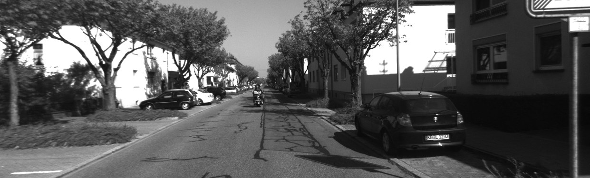
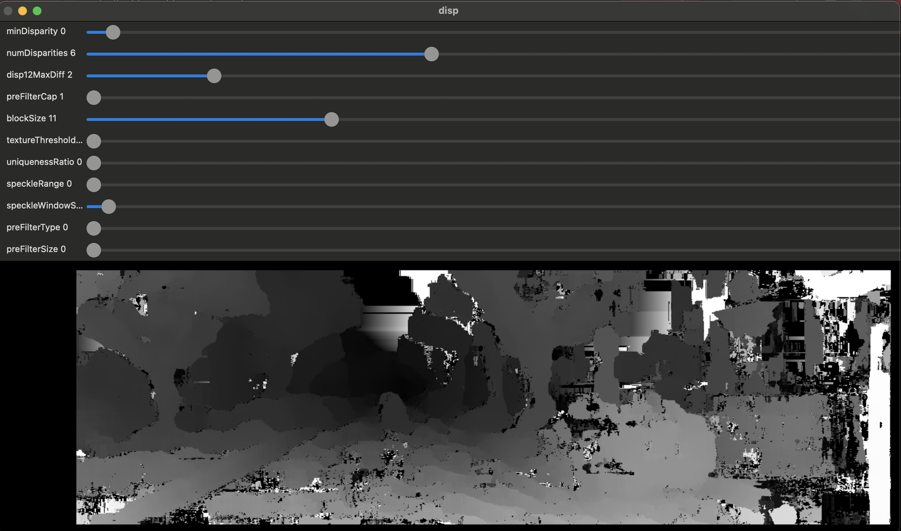
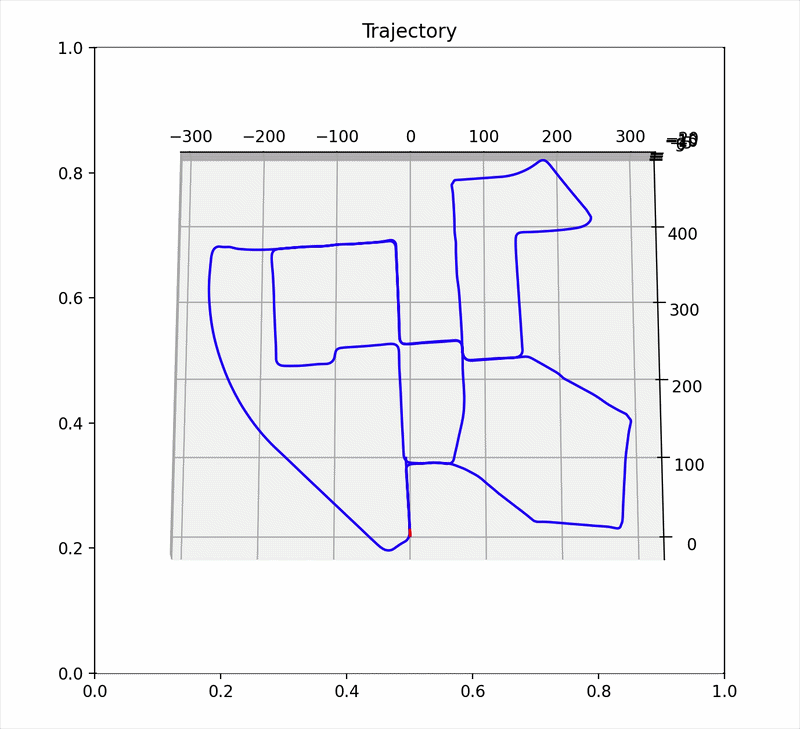

# ENPM673 Final Project - Visual Odometry

Download datasets from: https://www.cvlibs.net/datasets/kitti/eval_odometry.php
You need to download:  
ground truth poses dataset - 4MB  
grayscale dataset - 22GB

## REPO DESCRIPTION

This repository is set up to run eight different algorithms for visual odometry using the kitti benchmarking data set.
The odometry.py script is the main script to be run when wanting to run the different algorithms and visualize their performance.

Under the utilities folder, there are several helper scripts. The main features under utilities is StereoMatcherTester.py which provides
a GUI for optimizing stereomatcher paramters, and readResults.py which is used in the odometry.py script to
visualize/save plots. This can be run indepently after data has been saved from running odometry.py by writing the
path to the data you want to analyze. More comments within the scripts detail the function parameters and return elements,
and instructions, as well as an explanation of how the code functions, is found below.

## Example Outputs

Example image from the dataset
 
   

Running StereoMatcherTester.py to visualize the depth map created with the current Block Matching Algorithm settings.
 
  

Red - Calculated car position
Blue - Ground truth car route
 
  

## PREREQUISITES

1) Must have same file structure/hierarchy/naming EXACTLY as repo submitted, otherwise plotting/saving data will not work:

working directory
- kittiDataSet (folder)
    - poses (from kitti suite)
    - sequences (from kitti suite)
    - results 
        - algorithm_n (folder, need one for all 1->8 algorithms)
            - figs (folder)
            - temp (folder)
- utilities (folder)
    - readResults.py
- odometry.py

2) poses and sequences are downloaded from the kitti suite
    NOTE: you can use winrar to extract these to the right relative locations, otherwise you must manually add poses inside the dataset folder

================================================

# REPO INSTRUCTIONS

odometry.py:

NOTE: There is no need to modify the exisiting script. All options are chosen through terminal prompts and user Input.

1) Run the script: 

The menu of available algorithms will be listed. each option includes the stereomatcher, feature detector, feature matcher,
and filters used for the algorithms. 

2) Enter a number from 1-8, or -1:

To use one of those specific algorithms. There is a built in function to automatically
run all algorithms while saving all data. This can be used by entering -1. In this option, no graphs are displayed, but they are saved, this is done 
with time in mind, so that no input is required from the user the entire data collectin process. The script will end when finished.

2) Specifiy Temporary Data storage, Enter 0 or 1:

As seen in the folder structure of the repo, every algorithm folder under results also has a temp folder. This input determines whether all figures/summary
will be saved in 'figs' or in the temp file as to not Overwrite any desired data in already under the main algorithm folder.

3) Specifiy Live Plot display, Enter 0 or 1:

If turned on, with every iteration of the algorithm simulation, a plot will come up showing estimated path updates. This will make your computer run slightly slower.
Later on, a final plot will be shown if specified to do so - this is not the only time to see the plot

4) Specify whether or not to save JSON data, Enter 0 or 1 - IF ENTERED 1, AS IN TRUE, GO TO STEP 9 AND 10 THEN COME BACK TO 5:

JSON data includes all the data collected from the data run: all errors, trajectories, path, and algorithm description. This data is normally passed to the readResults.py
script which will then create all error/trajectory plots and the summary of results. This script will also save the plots in the respective folders of the repo. This is 
the reason the file structure is crucial.

5) Enter Start Pose []:

NOTE: this script only uses the first sequence of the gray kitti data set, and is built in. So therefore there are 4540 frames available - each 10 represent one second
of time as a 10 Hz camera is used. If the odometry.py script is modified to use a different sequences, you must check what frames are available for this terminal
prompt

This number specifies which frame of the sequences the algorithm starts simulation on.

6) Enter End Pose []:

See step#5, this number specifies which frame the algorithm will stop simulation on.

7) Enter ground truth injection period, a number less than 0.1 for NONE, and 0.1 or greater for that frequency:

Ground truth is available for the entire kitti data set. The number entered here specifies how often ground truth is used instead of estimated trajectory by the algorithm. Since
a 10Hz camera is used, the fastest ground truth can be injected is every 0.1 seconds, which results in no estimation by the algorithm.

9) Show all plots, Enter 0 or 1:

If true, the data written by the JSON saving will be read by the readResults.py script, and all analysis plots will be displayed along with the summary of results.
This is done after the algorithm reaches its specified end pose.

NOTE: The graphs have a waitforbuttonpress function meaning a button must be clicked for the next one to show up. Once all plots are shown, and a button is pressed after each,
the script will close all plots and end.

10) Save all plots, Enter 0 or 1:

if true, generated plots from the JSON data written with be saved in the algorithm folder. If temporary run was set to true in step 2, the plots with summary
will be saved in the temp folder under the algorithm folder used/

11) After all prompts are completed, the algorithm will begin running, printing time to process frame, and overall mean time per frame, until the end pose is reached.
In cases where auto data collection is not used, a final plot of the trajectory will be displayed even if live plot is off. This uses a waitforbuttonpress function, and a key
must be pressed for the plot to close and the script to end.

================================================

# CODE FUNCTIONALITY NOTES

- ALGORITHMS:

All algorithms are saved in seperate functions with the handle 'algorithm_n' and a comment describing the algorithm features. A docstring comment in each of these
code blocks detail the parameters used, and elements returned by the function. For mathematical concepts, see final report of this project.

- ERROR COMPUTATION:

The ground truth and estimated trajectories are passed to a single function, since all algorithm functions return the same scheme of data. Based on defined formulas, detailed
in the final report, the three errors: absolute, relative, and relative angular heading, is returned to be saved/read/visualized.

- SAVING JSON DATA:

Block of ground truth used (block between start and end pose), all estimated trajectories at every interval, all absolute error values at each instant, relative error
at each instant, and relative angular heading error at each instant, and algorithm string description is written to a JSON file under the path passed to the function.

When entering the number of the algorithm to be used for simulation, three things are noted: algorithm number, algorithm description, and algorithm path. The path is the
path in the current directory to the algorithm folder under results of the kitti data set folder. If temp run is specified, the path is altered to specify the temp folder
of the same algorithm. This is done using a python switch case based on the user input.

If -1 is passed, then auto data collection is specified, and a for loop begins. All algorithm handles, paths, and descriptions are saved in general lists. For each
iteration of the for loop, the three elements are updated to reflect the correct corresponding name, description, and path. All data saving is abolute, ie, not in the 
temporary folder

- SAVING/DISPLAYING  DATA PLOTS:

This is done using the readResults.py script under utilities. The function from here is imported for use in odometry.py. It is meant for dual purpose - to use in odometry.py
or indepently when the path of the JSON data is specified. The script reads the JSON file that was saved, which is why displaying all plots and saving them is 
disabled when choosing false for JSON data save. 

In odometry.py, the path updated by the user input and switch case statment is used and read by the readResults.py script. The script splits the JSON data based on the
keywords/headers. The data is saved in strings and used in conjunction with the matlab plotting library (matplotlib) for plot displaying. If save plots is true, an if
statment collects string segments from the path passed to the script to determine the right path to save the summary of results and figures. Again, this is why it 
is extremely important to have the same file/structure/naming scheme as this script depends on hardcoded string values for updating the plots save path.

- MAIN CALL:

There is no main function, only an if statment checking whether the computer is looking for main, in which the entire architecture of this project is written.
The terminal prompts are all called here in order, and all options are read to the user as described in the instructions. Based on these, either the switch case 
is used, or the for loop for automatic data collection.